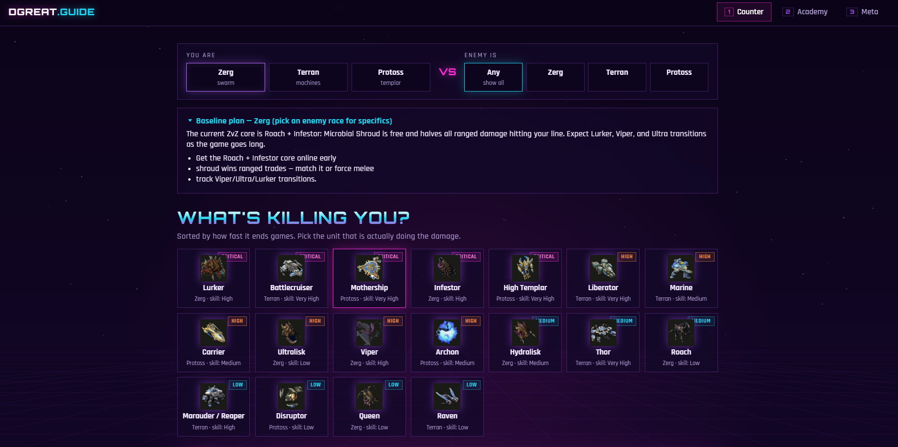
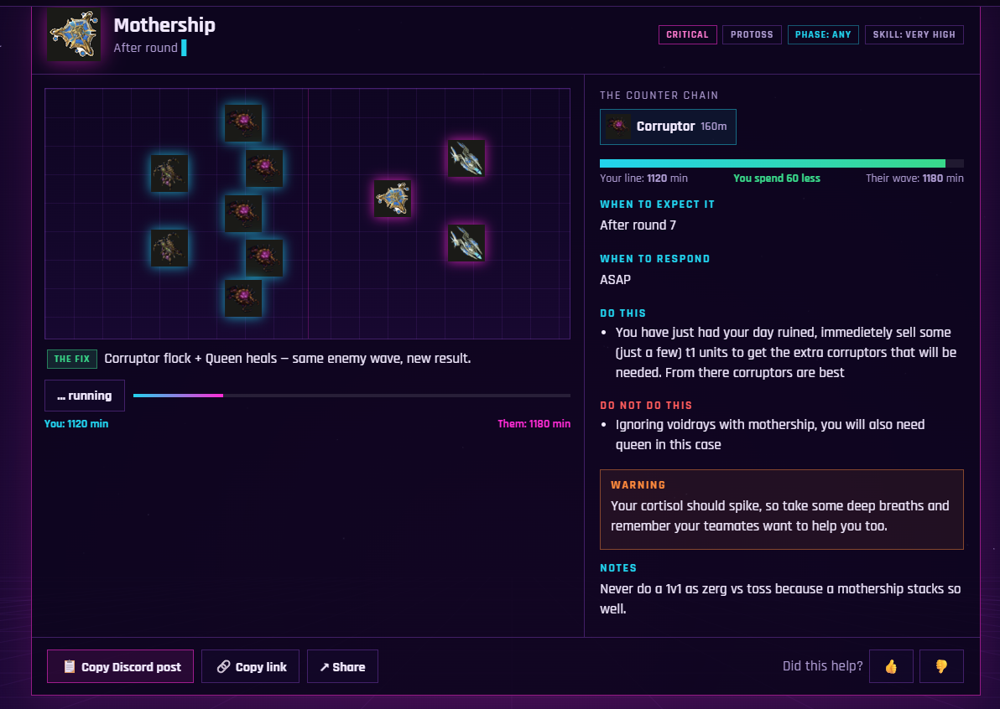
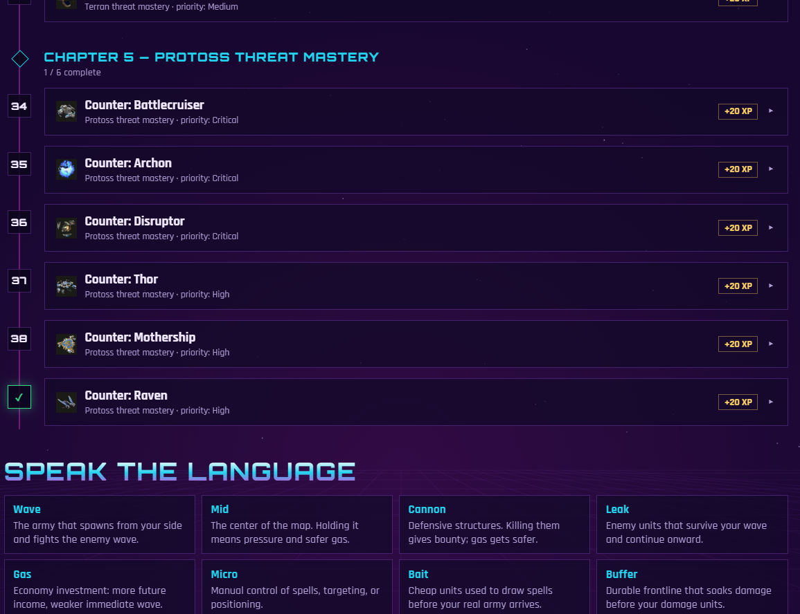
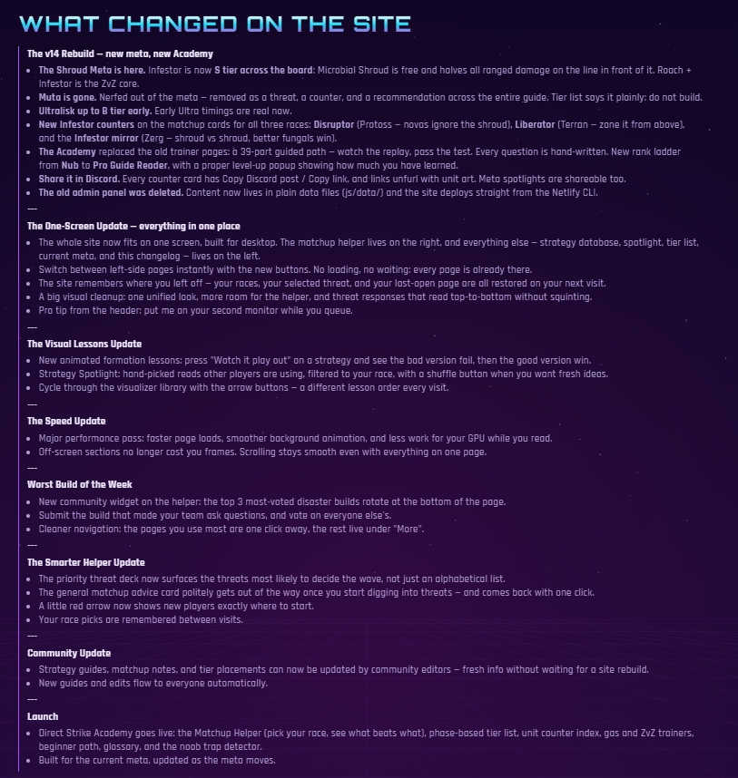
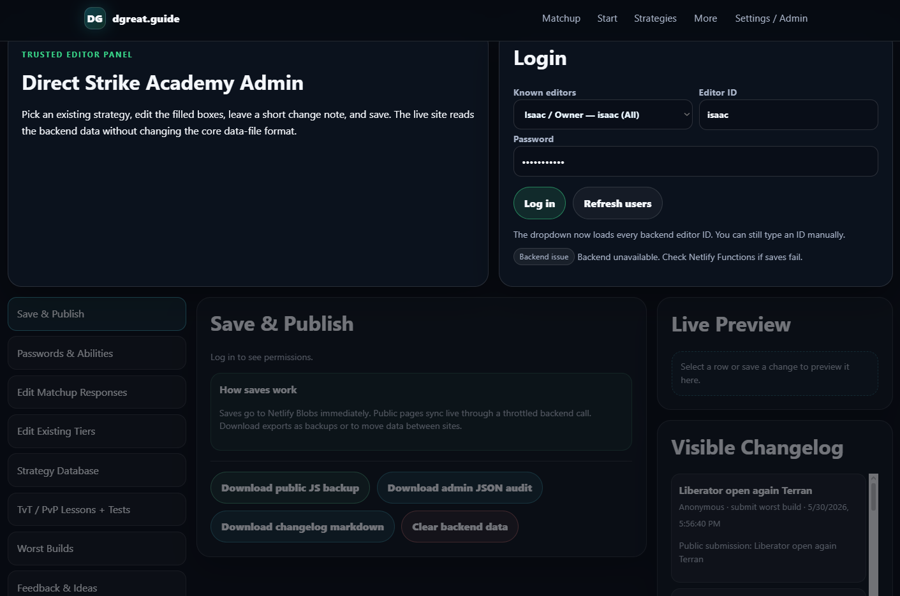

<h1 align="center">dgreat.guide</h1>

  <b>Interactive counter-strategy guide for Direct Strike, a StarCraft II 3v3 mode.</b> 
  Pick your race, see the threats that end games fastest, and watch the counter play out.

  
  
  

  

## Overview

Direct Strike players lose games to a handful of units they don't know how to answer. dgreat.guide ranks those threats by how fast they end games and gives a specific, actionable counter for each, with animated replays showing the wrong response failing and the right one winning.

Content was seeded and vetted by top-ranked competitive players (ranked by opponent-adjusted win rate), then migrated to a fully static architecture. See [Content Pipeline](#content-pipeline).

## Features

| | |
|---|---|
| **Matchup resolver** | Select your race and optionally the enemy's. Get threats ranked by severity, each with a priority rating and the skill level it demands. |
| **Counter cards** | Per-threat counter chain with cost comparison, when to expect it, when to respond, do / don't lists, and warnings. One-click copy as a Discord post or share link. |
| **Animated replays** | 27 scenarios show a failed formation, then the corrected one, against the same enemy wave. |
| **Academy** | A 39-lesson guided path with hand-written quizzes, XP, and a rank ladder from Nub to Pro Guide Reader. Progress persists locally. |
| **Meta page** | Tier list, spotlights, and a player-facing changelog (8 shipped releases). |
| **Strategy database** | 46 guides across 8 categories: counters, macro, timing, build orders, micro, lategame, team strategy, and meta notes. |

## Screenshots

<table>
  <tr>
    <td width="50%"> <b>Counter card</b> with replay, counter chain, and response timing</td>
    <td width="50%"> <b>Academy</b> guided path with XP and glossary</td>
  </tr>
  <tr>
    <td width="50%"> <b>Changelog</b> documenting every release</td>
    <td width="50%"> <b>Admin panel (retired)</b> used to collect expert-vetted content</td>
  </tr>
</table>

## Engineering Highlights

- **Zero-dependency front end.** Plain HTML, CSS, and JavaScript, organized into separate data, engine, replay, and view modules.
- **Backend-free architecture.** All content is served from static data files: no runtime API calls, no database, no login surface to secure.
- **Data-driven content.** Units, matchups, tiers, quizzes, scenarios, and guides live in plain data files, so content can change without touching application code.
- **Custom replay engine.** Scenarios are declarative: unit positions as stage percentages, formation type, and spell effects (storm, fungal, nova, mine). The engine animates the failed setup, then the fix.
- **Scripted data migrations.** Meta changes (such as removing a unit from every threat, counter, and recommendation) are applied by a script rather than by hand.
- **State persistence.** Race selection, active threat, last-viewed page, and Academy progress restore on return visits.
- **Accessibility and sharing.** Skip link, ARIA labels, live-region notifications, and Open Graph / Twitter cards so shared links unfurl with art.
- **Performance work.** Dedicated optimization pass to cut load time and GPU use from the animated background and off-screen sections.

## Content Pipeline

Accurate matchup data matters more than anything else on a guide site, so the content was built in two deliberate phases.

**Phase 1: Expert-sourced data entry.** A private, login-protected editor panel let top-ranked players enter and revise matchup responses, tiers, strategies, lessons, and tests directly. It included per-editor permissions, change notes, live preview, and backup exports. Saves were stored through Netlify Functions and Netlify Blobs.

**Phase 2: Permanent migration to static data.** Once the content was complete and vetted, I exported it into plain data files (`js/data/`) and retired the panel and its backend.

| | Before (editor backend) | After (static data) |
|---|---|---|
| **Runtime requests** | Recurring fetch and sync calls to the backend | None. All data ships with the page |
| **Moving parts** | Functions, Blobs store, editor auth | A static site |
| **Failure modes** | Backend outages could break saves and syncs | Nothing to go down |
| **Content changes** | Edited through the panel | Version-controlled in Git, deployed with the Netlify CLI |

The panel did its job: it got expert knowledge into the site quickly. Once that job was finished, keeping a live backend would only have added cost, latency, and attack surface. Removing it made the site faster, simpler, and more reliable.

## Tech Stack

`JavaScript` · `HTML5` · `CSS3` · `Netlify (Hosting, CLI)` · `Netlify Functions + Blobs (content phase)` · `localStorage` · `Open Graph`

## Author

**Isaac Erwin**: design, development, content pipeline, and ongoing maintenance.
[GitHub](https://github.com/isaaclee222) · [Live site](https://dgreat.guide)

## Changelog

<b>Release history (8 releases, newest first). Click to expand.</b>

### The v14 Rebuild: new meta, new Academy

- **The Shroud Meta is here.** Infestor is now **S tier across the board**: Microbial Shroud is free and halves all ranged damage on the line in front of it. Roach + Infestor is the ZvZ core.
- **Muta is gone.** Nerfed out of the meta, removed as a threat, a counter, and a recommendation across the entire guide. Tier list says it plainly: do not build.
- **Ultralisk up to B tier early.** Early Ultra timings are real now.
- **New Infestor counters** on the matchup cards for all three races: **Disruptor** (Protoss: novas ignore the shroud), **Liberator** (Terran: zone it from above), and the **Infestor mirror** (Zerg: shroud vs shroud, better fungals win).
- **The Academy** replaced the old trainer pages: a 39-part guided path. Watch the replay, pass the test. Every question is hand-written. New rank ladder from **Nub** to **Pro Guide Reader**, with a proper level-up popup showing how much you have learned.
- **Share it in Discord.** Every counter card has Copy Discord post / Copy link, and links unfurl with unit art. Meta spotlights are shareable too.
- **The old admin panel was deleted.** Content now lives in plain data files (js/data/) and the site deploys straight from the Netlify CLI.

### The One-Screen Update: everything in one place

- The whole site now fits on one screen, built for desktop. The matchup helper lives on the right, and everything else (strategy database, spotlight, tier list, current meta, and this changelog) lives on the left.
- Switch between left-side pages instantly with the new buttons. No loading, no waiting: every page is already there.
- The site remembers where you left off: your races, your selected threat, and your last-open page are all restored on your next visit.
- A big visual cleanup: one unified look, more room for the helper, and threat responses that read top-to-bottom without squinting.
- Pro tip from the header: put me on your second monitor while you queue.

### The Visual Lessons Update

- New animated formation lessons: press "Watch it play out" on a strategy and see the bad version fail, then the good version win.
- Strategy Spotlight: hand-picked reads other players are using, filtered to your race, with a shuffle button when you want fresh ideas.
- Cycle through the visualizer library with the arrow buttons. A different lesson order every visit.

### The Speed Update

- Major performance pass: faster page loads, smoother background animation, and less work for your GPU while you read.
- Off-screen sections no longer cost you frames. Scrolling stays smooth even with everything on one page.

### Worst Build of the Week

- New community widget on the helper: the top 3 most-voted disaster builds rotate at the bottom of the page.
- Submit the build that made your team ask questions, and vote on everyone else's.
- Cleaner navigation: the pages you use most are one click away, the rest live under "More".

### The Smarter Helper Update

- The priority threat deck now surfaces the threats most likely to decide the wave, not just an alphabetical list.
- The general matchup advice card politely gets out of the way once you start digging into threats, and comes back with one click.
- A little red arrow now shows new players exactly where to start.
- Your race picks are remembered between visits.

### Community Update

- Strategy guides, matchup notes, and tier placements can now be updated by community editors: fresh info without waiting for a site rebuild.
- New guides and edits flow to everyone automatically.

### Launch

- Direct Strike Academy goes live: the Matchup Helper (pick your race, see what beats what), phase-based tier list, unit counter index, gas and ZvZ trainers, beginner path, glossary, and the noob trap detector.
- Built for the current meta, updated as the meta moves.

